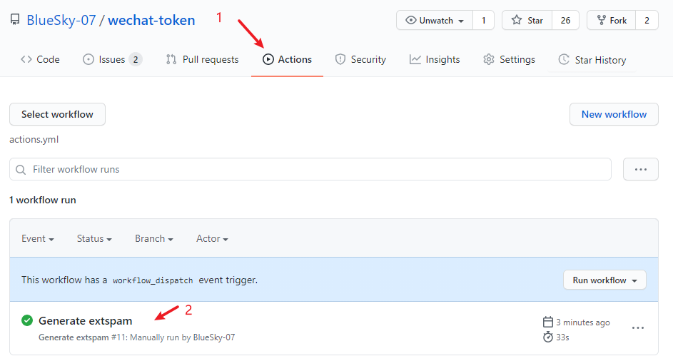
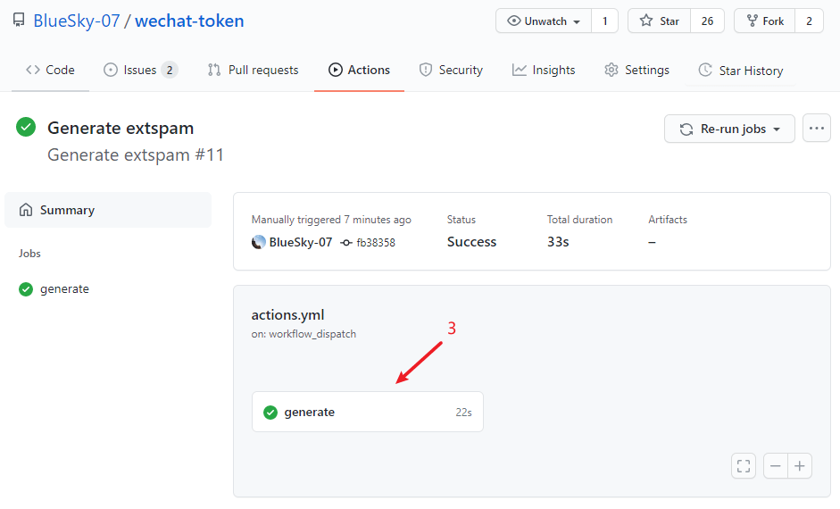
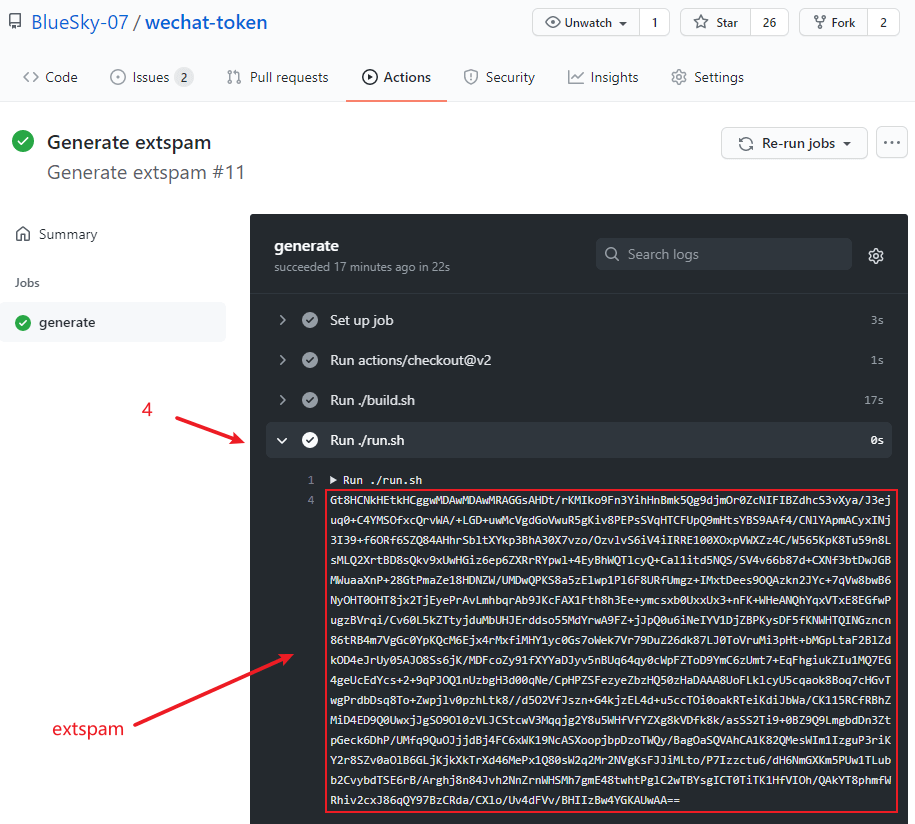

# wechat-token

## Ussage

```bash
# clone this repo
git clone https://github.com/BlueSky-07/wechat-token --depth=1

# generate token
./run.sh
```

## How to login Web-Wechat

1. visit [ModHeader - Import Profiles](https://bewisse.com/modheader/p/#NobwRAhgDlCmB2ATAsge0bMAuAZhANgM6wA0YARhAMYDWA5gE6oCuSAwqvqg9mAMQAmAKwBGAJwihYMjgCW+AC6wGhbMAC6ZABawIGFWvBVUAWxMIFvQF9qgLO1APArSwCCOXyxE2BQ2akw8COa8VPiyFgC0AG7KhLKo8I4RBD68AgB0AAwZYAC+JEam5vCWWGCA1hqAmYoABIiotMqV3vCVAO6wVFoQCmEKqDQIlYD4roAIRoAhbg5kzq7unt6+-oElsAAeCoRQAQlJmCU5mmBashgcZhYzPmQMsGsAErr6qlgaZIRa3AoAKrIKbrwijkorDhcHglPg4cEQ-5fH4lQB1+oBD+UA3m6AVX1AKYRgEA5RzMBj4ABKsCg+GosEKqzU6my6iAA)
2. install browser extension -- ModHeader
3. click **[IMPORT AND USE PROFILE]** button
4. fill the generated token in `extspam` value field
5. visit [https://wx.qq.com/?target=t](https://wx.qq.com/?target=t)
6. scan QRcode to login

## Github Actions

visit [Actions](https://github.com/BlueSky-07/wechat-token/actions) and view latest runner output to get generated `extspam`

***Note: Github Actions logs and artficts will keep in 24 hours***





## Acknowledgements

- [52pj](https://www.52pojie.cn/forum.php?mod=viewthread&tid=1347814)
- [AUR : wechat-uos](https://aur.archlinux.org/cgit/aur.git/tree/?h=wechat-uos)
